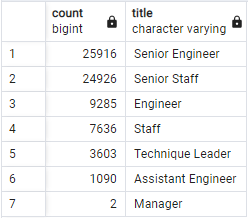
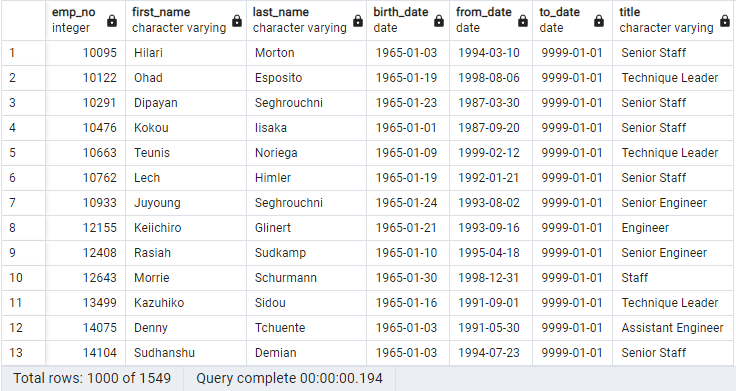
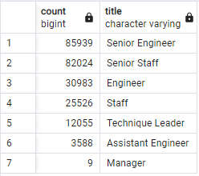

# Pewlett Hackard Analysis

## Overview of the Analysis

Due to a large portion of the company's workforce reaching retirement age, this analysis was conducted to determine the impact of employees retiring leaving many vacant roles in various departments. Of particular interest is gaining insight on which titles will be most affected by the departure of retirees, and in interest in preparing for those vacancies, the number of employees who meet certain criteria to participate in a mentorship program. The database was prepared in SQL using PostgreSQL, and all insights of the analysis were prepared by querying the database to narrow down points of interest. Potential retirees are considered as current employees born between 1952 and 1955. Mentorship opportunties are considered for current employees that were born in 1965.

## Results

|  |
|:---:|
| *Count of employees retiring by title in the company* |
* The bulk of the employees that are close to retirement are in Senior positions, either as an Engineer or Staff member. While it is expected that retirees that have likely been in the company for a long period of time would be in these positions, they are an overwhelming majority of over 50,000 of the employees near retirement of a total of 72,459 unique members.
* Of special concern, 2 Managers are near retirement along with 3,603 Technique Leaders. 
|  |
|:---: |
| *Mentorship eligibilty table* |
* The eligibility requirements of being born in 1965 returned 1,550 potential candidates.
* Even if all potential candidates were to to enter into the mentorship program, it is not even the current amount of employees in leadership roles.

## Summary
In the span of nearly 4 years a total of 72,459 employees in mostly Senior level positions will retire, leaving many vacanies that need to be filled by experienced candidates. Querying the counts of all roles for all current employees finds that of 167,963 people that are either Senior Engineers or Senior Staff, 50,842 will be leaving, making it that 30% of the Senior level employees will be retiring. While the overall number of employees that occupy Engineer or Staff positions currently is fewer at 56,509, employees at this level will experience a similar 30% loss. Keeping with the trend, 3,603 Technique leaders will retire, 30% of the total amount of 12,055.
|  |
|:---:|
| *Count of all current employees by title in the company* |

This is concerning when observing the current number of candidates that meet the eligibilty criteria for the mentorship program, which is only 1,550. It is not a reasonable assumption that all persons eligible will participate in the program, and the number pales in comparison to the number of vacancies. Additionally candidancy is assumed based on age alone rather than role or time within the company, exploring the counts of each role for current employees born in 1965 finds that while 592 of the employees are Senior Staff that are likely suitable potential mentors, there are only 169 Senior Engineers eligible compared to 501 Engineers. Even if time was taken to train Engineers to take over Senior Engineer positions, it still fails to address the current age used to determine eligibilty is insufficient to properly address the number of openings that will be seen at all levels of employment for the company. To address this increasing the range of ages to determine eligibilty is suggested to acquire more candidates.
|  |
|:---:|
| *Count of mentorship candidates by title in the company* |
